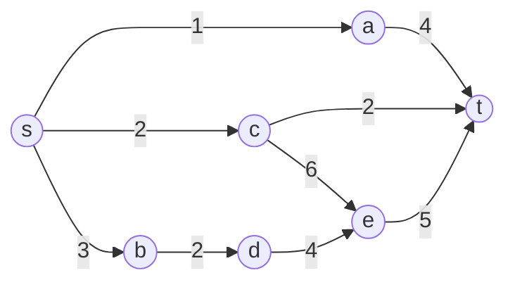

网络流，作为图论问题中的一种，具有着奇妙的性质（指模板改改能过不少题），特殊的写法（指BFS+DFS双重打击），以及优美的时间复杂度（指Dinic优化前DFS直接跑炸）。

<!-- more-->

## 网络流
要想学会网络流，首先要理解网络流的含义，也就是“网络”和“流”。
### 网络
简单来讲，网络就是一个有向带权图，其中有两个特殊点：入度为0的源点$s$，和出度为0的汇点t。网络中的边权被称为容量。
下图是一个简单的网络，其中$s$为源点，$t$为汇点。（我不是我没有我真没有抄别人课件QwQ）

### 流
流的定义有些难以理解，所以这里提供一个我个人的理解方式。
流可以被理解为基于原网络建立的一张新图，满足以下三个性质：
1. 新图中每条$(u,v)$边的流量小于等于原网络中这条边的容量。
2. 流入节点的流量等于流出节点的流量，流出源点的流量等于流入汇点的流量。
3. 每条边的流量与反向边的流量之和为0。
第三条性质会在后面用到。
## 常见的网络流问题
### 最大流
字面意思，最大化网络中的流。
### 最小割
将网络中的点分成两个集合，$s$和$t$分别位于两个集合中，使得连接两个集合的边容量尽量小。
### 费用流
每条边有了一个单位流量的费用，求最大流的同时最小化费用。