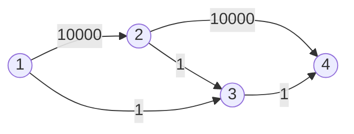
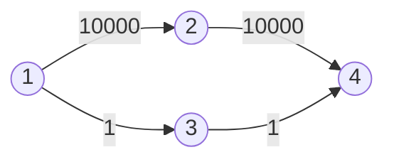
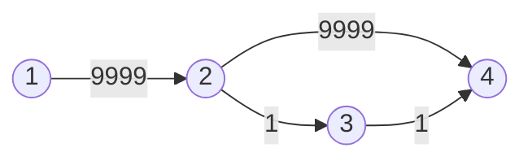

那么我们现在开始学习网络流中的最大流问题。[上一篇](/2022/08/10/network-flow-1/)应该讲过了，那么我们直接开始讲解求解最大流问题的算法：$\text{Ford-Fulkerson}$方法（$\text{Method}$）
<!-- more-->
# Ford-Fulkerson（FF）
之所以叫做“方法”，是因为它并没有确切的实现，而是类似于提供一个最大流问题的解法模板：在残量网络中寻找增广路。
## 残量网络和增广路径
残量网络，顾名思义（这哪里能顾名思义出来啊喂），就是在已经有边通过流量之后剩余的网络。更加形式化的定义就是，所有当前剩余流量$c$大于$0$小于容量$f$的边组成的网络。
增广路径的名字就有点生硬了（$\text{Augmenting Path}$是怎么翻译成这样的）。但它的概念很容易理解：增广路径就是残量网络中从源点$s$到汇点$t$的一条路径。
## FF的核心概念
讲到这里，你大概就明白FF的基本原理了：
	通过不断在残量网络中寻找增广路径来对其进行增广，最终到无法找出增广路径时，就找到了最大流。
# FF的具体实现
在开始讲算法之前，我先讲一个关乎算法正确性的东西：反向边。
下图是一个简单的网络。


这张网络上的最大流如下：

但是如果算法运行是先走`1->3->2->4`这条路，就会得出一个神奇的错解：

此时如果我们加入`2->3`这条反向边，就可以在发现解非最优时走这条“反悔”边来抵消“抵消”`3->2`这条边的错误选择。
## Edmonds-Karp（EK）
EK的思路就是通过BFS找增广路径。每次找到一条从$s$到$t$的增广路。
代码实现无
>EK算法的时间复杂度是$O(n^3)$的，在多数情况下不如Dinic算法表现好，所以日常就不怎么用了，也没有代码实现。

## Dinic
Dinic算法的具体实现也很简单：DFS增广。听起来也是一个$O(n^3)$算法，但是不同的是，Dinic进行了如下优化
1. 使用BFS对图进行分层，同时求是否可以找到一条增广路径。
2. 如果可以，那就重复进行DFS找增广路径并增广。在进行增广时，注意只向层数大的点走，这样可以保证一定在$O(n)$时间内找到增广路径。

凭借着优秀的优化，Dinic的时间复杂度到了$O(n^2m)$。听起来在稀疏图上没有EK快，但是实际上在大多数图上Dinic都有不亚于EK的效率。
其实还有几个常用的优化方法。
### 当前弧优化
名字可能有点难以理解，但是这个优化的本质很简单：
>被增广过的路径，在本次BFS分层内不会再次被增广。

代码实现也很简单，只是每次把`head`数组换成一个副本`cur`，每次遍历边的时候把`cur`也更新一下就好了。
### 多路增广
顾名思义，就是在DFS找增广路时用残存流量再找一条新的增广路径出来，实现一次DFS找多条增广路的效果。

### 代码实现（多路增广优化）
```c++
bool bfs() {
  queue<int> q;
  memset(dep, 0, sizeof dep);
  q.push(s);
  dep[s] = 2;
  while (!q.empty()) {
    int u = q.front();
    q.pop();
    for (int i = head[u]; i; i = nxt[i]) {
      int v = to[i];
      if (!dep[v] && val[i] > 0) {
        dep[v] = dep[u] + 1;
        q.push(v);
      }
    }
  }
  // 如果不能到达t则直接结束算法
  return dep[t] != 0;
}
// 返回x这条边的反向边
inline int get(int x) { return (x & 1) ? x + 1 : x - 1; }
int dfs(int x, int fl) {
  if (x == t) {
    return fl;
  }
  int result = 0;
  for (int i = head[x]; i; i = nxt[i]) {
    int v = to[i];
    if (val[i] <= 0) {
      continue;
    }
    if (dep[v] == dep[x] + 1) { // 每次向深度多1的边走
      int flow = dfs(v, min(fl, val[i]));
      if (flow) {
        val[i] -= flow;
        val[get(i)] += flow;
        // 如果还有残余流量，则继续增广。
        fl -= flow;
        result += flow;
        if (fl <= 0)
          break;
      }
    }
  }
  return result;
}
```

